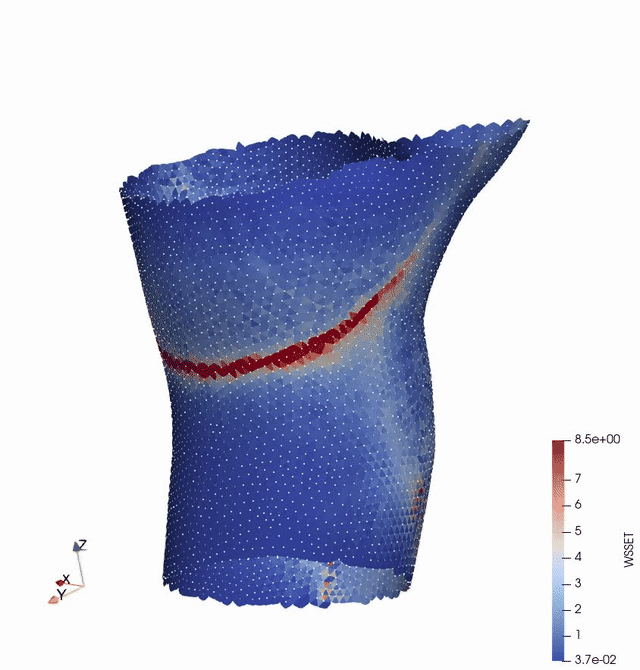

# WSS topology and near-wall transport — ParaView plugin (unsteady WSS)

A ParaView plugin that runs the complete WSSLCS analysis of wall shear stress
(WSS) vector fields directly on the surfaces loaded in ParaView, steady or
unsteady (a file series = the frames of one cardiac cycle):

* **surface tracers**, residence time and **WSS exposure time** (WSSET),
  staggered release, wall-normal diffusion / divergence models, flux from the
  wall, tagged tracers, single tracers;
* **WSS fixed points** and their **stable / unstable manifolds** (WSS
  Lagrangian coherent structures), of the current time step or of the time
  averaged field;
* **fixed points tracked in time** and their exposure time;
* the **time-series metrics** TAWSS, OSI, RRT, time-averaged WSS divergence
  and TSVI.



*Staggered tracer release and surface transport: surface tracers (white
points) released in several batches and advected by the WSS field; the surface
is coloured by the WSS exposure time (analysis 5, staggered release).*

The plugin adds one filter, **WSS Surface Transport** (menu *Filters › WSSLCS*),
with four outputs: the surface with the result arrays, the fixed points, the
lines (manifolds, tracer paths, single trajectory) and a time dependent
output with the tracer snapshots (or the fixed points in time) that animates
with ParaView's time controls. It wraps the Python/VTK package `wsslcs` of
the WSSLCS project (the same code as the command-line program, the desktop
application and the web app) and reproduces its results exactly.

## Installation

Requirements: ParaView 5.10 or newer with Python (the binary releases from
paraview.org include Python and numpy; tested with ParaView 5.11.1 on macOS).

1. Download or clone this repository. Keep the folder structure: the plugin
   file `WSSLCSPlugin.py` and the package folder `wsslcs/` must stay next to
   each other.
2. In ParaView: *Tools › Manage Plugins › Load New…*, select
   `WSSLCSPlugin.py`. Tick *Auto Load* to load it at every start.
3. After you load your WSS time series right click on the file, select add filter, and select WSSLCS --> WSS surface transport filter. Under analysis, you can select the option you are interested in (currently, not all tested but the main unsteady features WSS exposure time and surface tracers should work.
4. With a remote `pvserver`, load the plugin on the server (the files must
   be on the server machine) and on the client.

Batch use (`pvpython`, `pvbatch`):

```python
from paraview.simple import *
LoadPlugin("/path/to/WSSLCSPlugin.py", remote=True, ns=globals())
reader = LegacyVTKReader(FileNames=[...frames of one period...])
f = WSSSurfaceTransport(Input=reader)
f.WSSVectors = ["POINTS", "wss"]
f.WSSScale = 0.03
f.TimeBetweenFrames = 0.1
f.Analysis = "Surface tracers: residence time + WSS exposure time"
f.IntegrationTime = 1.0
f.UpdatePipeline()
SaveData("surface.vtp", proxy=f)                                   # port 0
SaveData("tracers.pvd", proxy=OutputPort(f, 3), WriteTimeSteps=1)  # snapshots
```

`examples/pvpython_example.py` is a complete script; `tests/test_plugin.py`
(run with `pvpython`) checks the plugin against the command-line program.

## Using the filter

1. **Load the WSS surface.** A single file (steady or time-averaged WSS) or
   a file series (`wss_0.vtk`, `wss_1.vtk`, … — ParaView groups the files
   into one time series). The surface must be triangulated (other cells are
   triangulated, unstructured grids are converted to their surface) and
   carry a 3-component point array with the WSS vectors.
2. **Filters › WSSLCS › WSS Surface Transport.** Choose the *Analysis*, the
   *WSS Vectors* array and the *WSS Scale* (default 0.03: the tracer
   velocity is `WSS scale × WSS`, i.e. `δn/μ`, the near-wall velocity at
   the distance `δn` from the wall). Only the parameters of the chosen
   analysis are shown; *Apply*.
3. **Unsteady data.** With *Use All Time Steps* on (default), all time steps
   of the input are the frames of **one period**: the filter fetches them
   through the pipeline (one pass per frame, so the first *Apply* on a
   sequence reads all files), interpolates the WSS field linearly in time,
   and continues **periodically** when the integration time exceeds the
   time spanned by the files (the frame after the last one is the first one
   again, backward integration wraps the other way). *Time Between Frames*
   gives the physical spacing of the frames (0: use the time values of the
   input; a file series without time information counts 0, 1, 2, …), and
   *Release At Frame* the frame at which the integration starts. With *Use
   All Time Steps* off, the analysis uses the current time step only
   (steady analysis of one frame, following the animation time).
4. **Outputs** (select the port in the pipeline browser):

   | port | content |
   |---|---|
   | 0 Surface | the input surface with its arrays plus the results: `wss_magnitude`, `divergence`; `RT` (residence time of the tracer released at each vertex), `status`, `y_normal`; `ET`, `ET_norm`, `WSSET` (cells) with `WSSET_point`, `ET_point`; `SingET`, `SingET_norm`, `SingET_nodal`, `SingET_nodal_eig`; `TAWSS`, `TAWSS_vector`, `OSI`, `RRT`, `WSSdiv_TA`, `NormWSSdiv_TA`, `TSVI`, `TSVI_valid`, …; `poincare_index` |
   | 1 Fixed points | vertices with `type` (1 source, 2 sink, 3 saddle, 4 center, 6 attracting focus, 7 repelling focus), `poincare_index`, `triangle`, eigenvalues and eigenvectors |
   | 2 Lines | stable / unstable manifolds (`manifold` 0 unstable, 1 stable; `saddle`, `branch`, `length`, `arclength`, `speed`), the tracer paths (with *Tracer Paths*), or the single trajectory (`time`, `wss_magnitude`, `triangle`) |
   | 3 Tracers | time dependent: the tracer positions at the snapshot times (`particle_id`, `RT`, `status`, `tracer_tag`, `y_normal`), the fixed points in time (analysis 8), or the position of the single tracer; use the animation controls (the snapshot times are added to the time keeper and expressed in the time axis of the input: release time plus elapsed time, converted with *Time Between Frames* when the file series has no time information, so that the tracers animate in step with the WSS frames) |

   *Write VTK Files To Folder* (advanced) additionally writes the files of
   the command-line program (`_RT`, `_ET`, `_Traj.k` + `.pvd`, `_FixedPoints`,
   `_Manifolds`, `_SingET`, `_WSSmetrics`, …) into a folder.
5. **Tagged tracers** (analysis 10): connect a point set (with an integer
   point array `tracer_tag`) to the *Seeds* input; the seeds are projected
   on the surface.

### Analyses and parameters

| analysis (`flag_code` of the program) | parameters |
|---|---|
| Fixed points + manifolds (12), fixed points only (11) | *Ignore Boundary Triangles*, *Zero Tolerance*, manifold step / max. steps / max. length / perturbation / capture radius (relative to the local √area) |
| Residence time + WSS exposure time (1), tracers only (2) | *Time Step*, *Integration Time*, *Direction*, *Integrator* (Euler as in the papers, or RK4), *Number Of Snapshots*, *Release At Centroids*, *Tracer Paths* |
| Staggered release (5) | + *Number Of Releases*, *Time Between Releases* |
| Wall-normal diffusion (6), flux from the wall (9) | + *Diffusion Coefficient*, *Max Wall Normal Distance*, *Viscosity*, *Random Seed* |
| Wall-normal velocity from the WSS divergence (7) | + *Max Wall Normal Distance*, *Viscosity* |
| Tagged tracers (10) | + the *Seeds* input |
| Single tracer (3, 4) | *Release Point* (snapped to the surface) or *Release Vertex Index* |
| Fixed points tracked in time (8) | *Time Step*, *Integration Time*, *Number Of Snapshots*, fixed point options |
| Time-series metrics (13) | *Zero Tolerance* (a WSS below it counts as zero for the normalized field) |

*Max Triangle Crossings Per Step* (advanced) limits the number of triangles
a tracer may cross within one time step.

## Methods

The WSS vectors are projected on the vertex tangent planes and transported
into the triangles with the discrete polar map of the vertex fans; inside a
triangle the field is the linear interpolation of the three transported
corner vectors. Tracers live in (triangle, local coordinates) and are
integrated with the linear field of the current triangle, with exact edge
crossings into the neighbouring triangles; the time spent in every triangle
is accumulated exactly and gives the WSS exposure time
`WSSET = ET/T · √(A_m/A_e)` (Eq. 5 of [1]); the residence time is the time a
tracer stays on the surface. Fixed points are located in the triangles with
a non-trivial Poincaré index as the zero of the linear field and classified
by the Jacobian eigenvalues; the manifolds are the trajectories leaving the
saddles along their eigenvectors, forward (unstable manifold, attracting WSS
LCS) and backward (stable manifold, repelling WSS LCS) [1, 3]. For unsteady
data the field is interpolated linearly in time between the frames of the
period and continued periodically; the fixed points of the interpolated
field are tracked at every time step [2]. The time-series metrics are
`TAWSS = (1/T)∫|τ|dt`, `OSI = ½(1 − |∫τdt|/∫|τ|dt)`, `RRT = 1/|(1/T)∫τdt|`,
`WSSdiv_TA = (1/T)∫∇·τ dt`, `NormWSSdiv_TA = (1/T)∫DIV_W dt` with `DIV_W = ∇·(τ/|τ|)`
the divergence of the normalized WSS vector field, and
`TSVI = [(1/T)∫(DIV_W − NormWSSdiv_TA)²dt]^½`, the root mean square deviation of
`DIV_W` from its cycle average (Mazzi et al. 2020). The discrete surface
divergence is first-order accurate (checked against the analytic divergence
of unit fields on a sphere); the divergences and TSVI are per mesh length
unit (multiply by 1000 for a mesh in mm to obtain the 1/m of the literature); triangles touching a vertex with a
zero WSS (caps), where the normalized vector is undefined, are flagged in
`TSVI_valid` and set to 0.
**Nodal versus per-triangle TSVI, and the ParaView pipeline.** `TSVI`
(cells) is the RMS deviation computed in every triangle.  The nodal
`TSVI_point` is computed *node-first*: `DIV_W` is averaged to the nodes at
every frame (plain average of the triangles around the node, as VTK's
Gradient filter does) and the RMS deviation over the cycle is taken of the
nodal values.  This is exactly what the ParaView pipeline *Calculator
`norm(WSS)` → Gradient → Calculator `Gradient_0+Gradient_4+Gradient_8` →
Temporal Statistics (stddev)* computes: on the synthetic sequence the two
agree to 0.2 % (correlation 1.0000; Temporal Statistics' stddev is the
population RMS, i.e. the `(1/T)∫` of the definition).  Averaging the
per-triangle RMS values to the nodes instead gives larger values (an average
of RMS values exceeds the RMS of the averages), about 5 % on average and more
near the fixed points; the per-triangle `TSVI` is the sharpest of the three.

`examples/compare_with_paraview_pipeline.py` (run with `pvpython`) builds that
pipeline next to the filter and prints the comparison.

## Files

| file | content |
|---|---|
| `WSSLCSPlugin.py` | the plugin (filter definition, ParaView pipeline integration) |
| `wsslcs/` | the analysis package (mesh, field transport, tracers, exposure time, fixed points, manifolds, metrics, VTK I/O) |
| `examples/data/` | a synthetic 8-frame WSS sequence on a carotid artery patch (period 0.8), a tagged seed file and the steady TAWSS of the patch |
| `examples/pvpython_example.py` | batch example |
| `docs/WSS_surfacetracer_staggered.gif` | animation of a staggered tracer release |
| `tests/test_plugin.py` | end-to-end test (`pvpython tests/test_plugin.py`): every analysis through the ParaView pipeline against the command-line program |

The synthetic sequence is made from the patch by modulating the WSS
magnitude and rotating the vectors in the tangent plane in time; it
exercises the unsteady analyses but is not a measured flow.

## References

The methods implemented here were developed in the following papers; please
cite them if you use this plugin:

1. Arzani, A., Gambaruto, A. M., Chen, G. and Shadden, S. C., *Wall shear
   stress exposure time: A Lagrangian measure of near-wall stagnation and
   concentration in cardiovascular flows*, Biomechanics and Modeling in
   Mechanobiology, 16(3), 787–803, 2017.
2. Arzani, A., Shadden, S. C., *Wall shear stress fixed points in
   cardiovascular fluid mechanics*, Journal of Biomechanics, 73, 145–152,
   2018.
3. Arzani, A., Gambaruto, A. M., Chen, G. and Shadden, S. C., *Lagrangian
   wall shear stress structures and near wall transport in high Schmidt
   aneurysmal flows*, Journal of Fluid Mechanics, 790, 158–172, 2016.

The surface transport part (surface tracers advected by the WSS field, their
residence time and accumulation along the WSS Lagrangian coherent
structures) comes from [3]; the WSS exposure time, the wall-normal models
and the fixed point / manifold computation from [1]; the WSS fixed points,
their classification and their exposure time in unsteady flow from [2]. The
topological shear variation index follows Mazzi, V., Gallo, D., Calò, K.,
Najafi, M., Khan, M. O., De Nisco, G., Steinman, D. A. and Morbiducci, U.,
*A Eulerian method to analyze wall shear stress fixed points and manifolds
in cardiovascular flows*, Biomechanics and Modeling in Mechanobiology, 19,
1403–1423, 2020.

Related: the browser apps https://github.com/amir-cardiolab/WSS-topology
(fixed points and manifolds).
